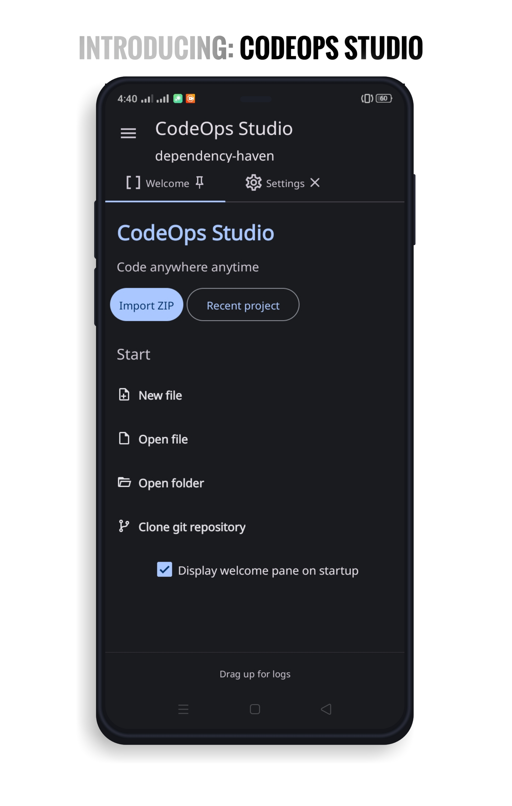
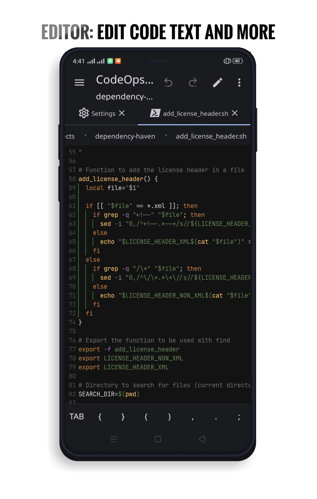
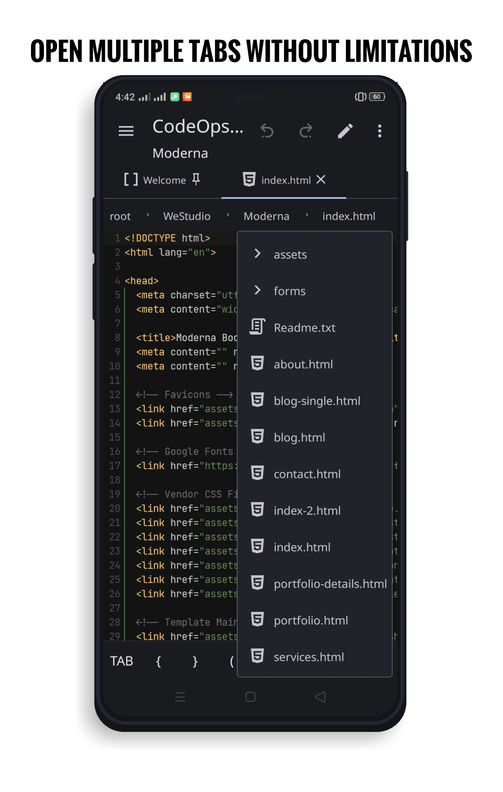
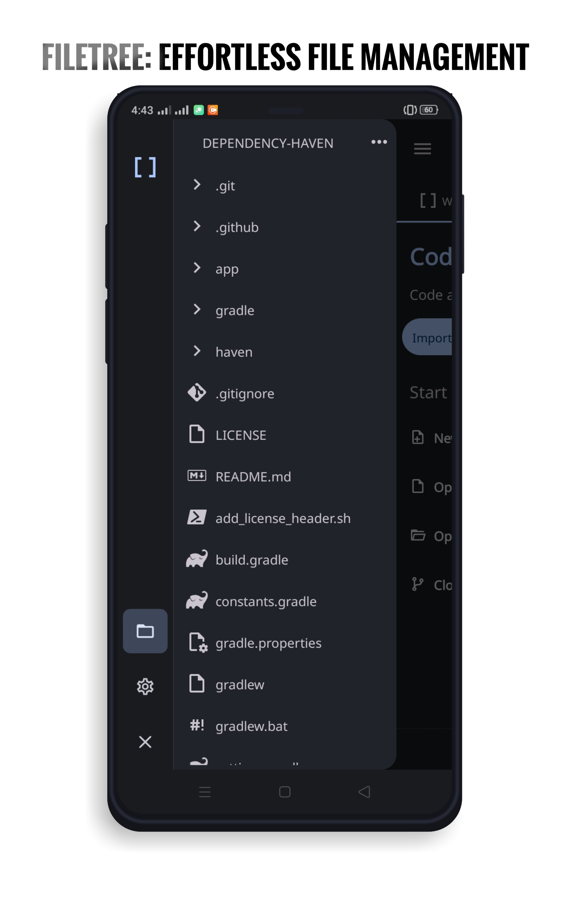
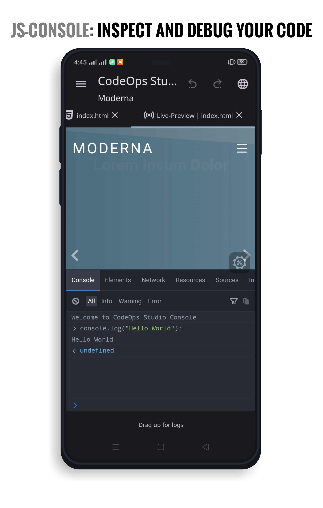
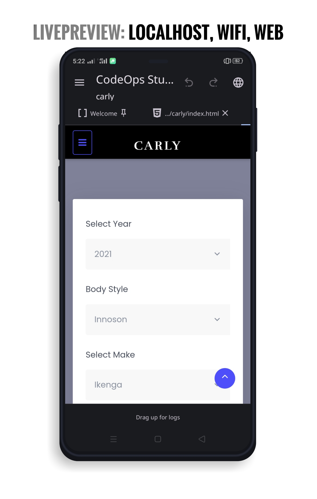

# CodeOps Studio

Welcome to **CodeOps Studio** is a free and open-source code editing workspace and Integrated Development Environment (IDE) designed specifically for Android OS.

> [!NOTE]\
> Development of CodeOps Studio is currently slow until i get a PC :( that's to say your pull requests to the `main branch` containing Kotlin, Python, C, C++ code would be rejected for now.\
> Otherwise consider the `dev branch` (A fun place for experiments).\
> CodeOps Studio is **NOT** intended for piracy and other non-legal uses. It could be used for localizing and adding features, adding support for custom platforms, and other GOOD purposes. Just try to be fair with the authors of an app, that you use and probably like.

> [!IMPORTANT]\
> CodeOps Studio main focus is on Android OS. Using it one other operating systems maybe impossible unless emulated, there is no guarantee that it'll work perfectly without errors.\
> Minimum Android API level is `API level 26 (Android 8)`.\
> Support for screens > 600dp is still experimental :)

### Goals
  * Make coding possible anywhere anytime
  * Provide advanced dev-ops tools and features
  * Provide opportunity for anyone to code without a laptop
  * Bring Visual Studio code and IntelliJ-like development experience to Android devices
  * Support core `integrated development environment` fundamentals (Building, Debugging, Version Control, and Extensibility, e.t.c)
  
## Core Features
- [ ] Git Integration
- [ ] Auto completions
- [x] File Tree Explorer
- [x] Advanced Code Editor
- [x] Multi-Pane Tab editor
- [x] BreadCrumb Navigation
- [x] Web Development support
- [x] Multi-Language Syntax Highlighting

## Screenshots 

     

## Installation
Current software version is `v1.0.1 beta`.

[](https://github.com/euptron/CodeOps-Studio/releases)

**Important:** Always install CodeOps Studio from trusted sources:
- [GitHub Releases](https://github.com/euptron/CodeOps-Studio/releases)
- [GitHub Actions](https://github.com/euptron/CodeOps-Studio/actions?query=branch%3Amain+event%3Apush)

### Steps to Install
1. Visit the [GitHub Releases](https://github.com/euptron/CodeOps-Studio/releases) page.
2. Download the latest CodeOps Studio APK.
3. Install the APK on your device and start coding anywhere anytime.

## Important Links

### Community
To stay updated join our community to stay updated on the latest developments.

- [CodeOps Studio Telegram Channel](https://t.me/codeopsstudio)
- [CodeOps Studio X (formerly Twitter)](https://x.com/codeopsstudio)
- [CodeOps Studio Blog](https://codeopsstudio.blogspot.com/p/documentation.html)
- [DEV Reports Email](mailto:etido.up@gmail.com)

## Contribution Guidelines

We welcome contributions from the community! Please see our [Contribution Guidelines](./CONTRIBUTING.md) for detailed instructions on how to contribute.

## License

This project is licensed under the GNU General Public License v3 (GPLv3). By contributing to this project, you agree that your contributions will be licensed under the GPLv3 as well.
Any violations to the license can be reported either by opening an issue or writing a mail to us directly.

You can read the full text of the license [here](./LICENSE).

### License Notice

When you add new files to the project, please include the following license notice at the top of each file:

```plaintext
/*
 * This file is part of CodeOps Studio.
 *
 * CodeOps Studio is free software: you can redistribute it and/or modify
 * it under the terms of the GNU General Public License as published by
 * the Free Software Foundation, either version 3 of the License, or
 * (at your option) any later version.
 *
 * CodeOps Studio is distributed in the hope that it will be useful,
 * but WITHOUT ANY WARRANTY; without even the implied warranty of
 * MERCHANTABILITY or FITNESS FOR A PARTICULAR PURPOSE. See the
 * GNU General Public License for more details.
 *
 * You should have received a copy of the GNU General Public License
 * along with CodeOps Studio. If not, see <https://www.gnu.org/licenses/>.
 */
```
You can do so automatically by using the [add_license_header.sh](./docs/add_license_header.md) script.

## Code of Conduct

Please note that this project adheres to a [Code of Conduct](./CODE_OF_CONDUCT.md). By participating, you are expected to uphold this code.

For any questions or clarifications, feel free to open an issue or contact the maintainers.

Thank you for your using CodeOps Studio and your contributions.

<!--
## Sponsorship

Support CodeOps Studio's growth by becoming a sponsor. Donate via [OpenCollective](https://opencollective.com/codeopsstudio). Your donation will play a vital role in driving the project's growth and success.

*Funding Transparency*

CodeOps Studio utilizes OpenCollective to manage and transparently display our funding. Your sponsorship will be acknowledged and appreciated.

*Gratitude*

We extend our sincere gratitude to our existing sponsors for their invaluable support.
-->
## Special thanks

- CodeAssist

- AndroidIDE 
