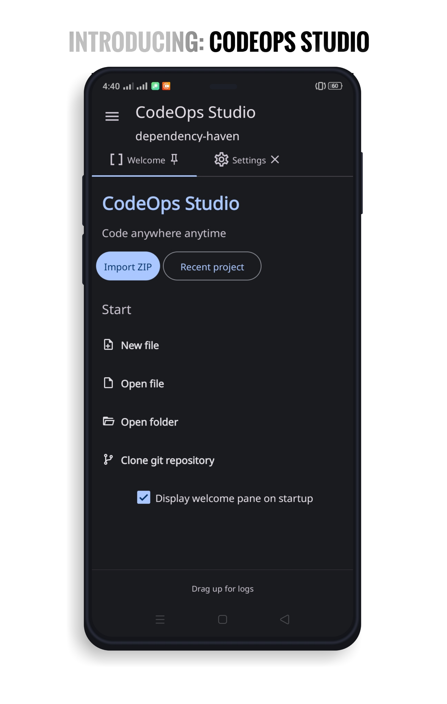
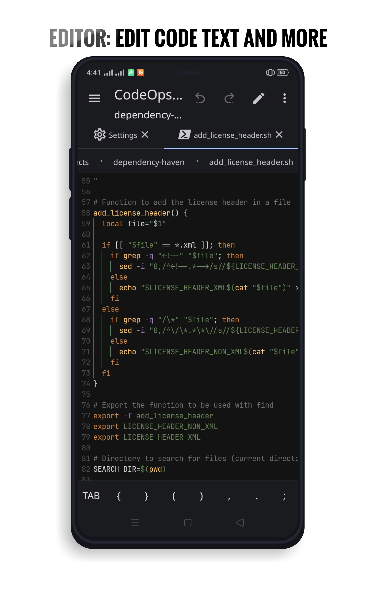
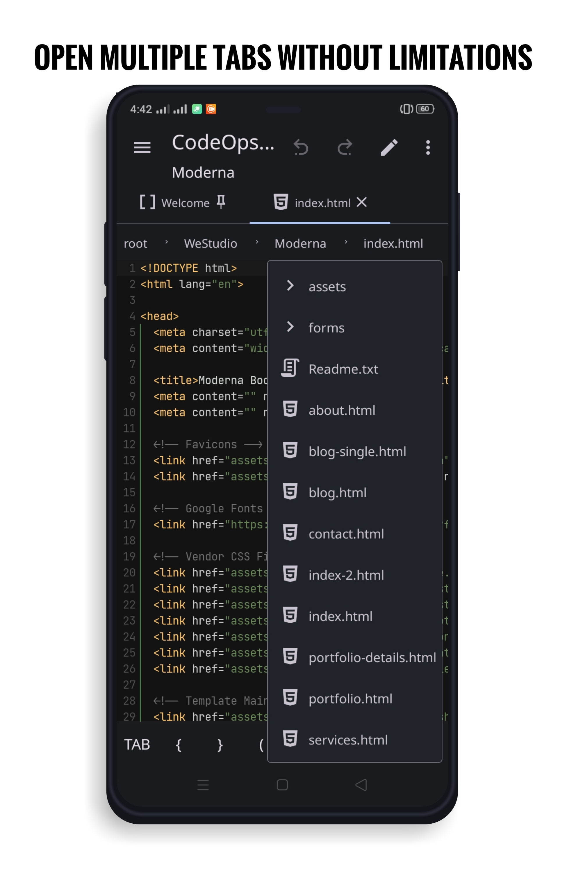
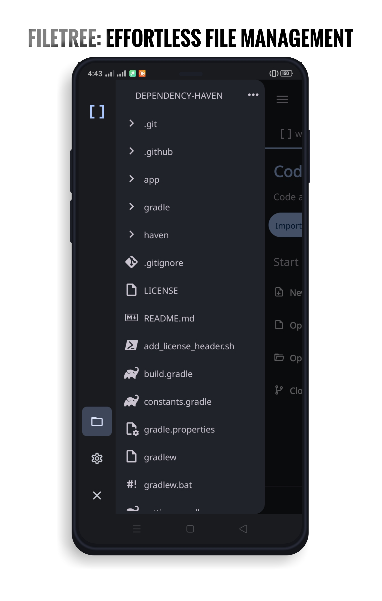
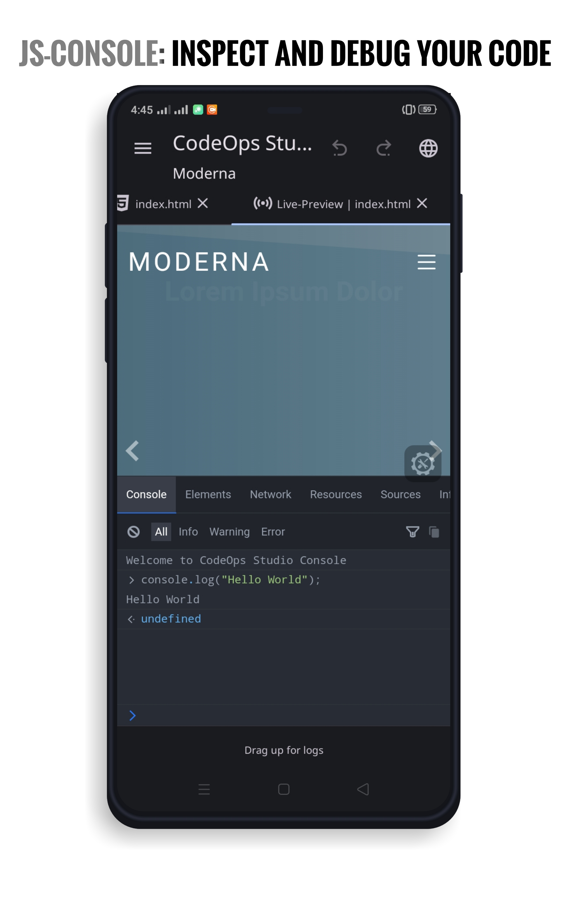
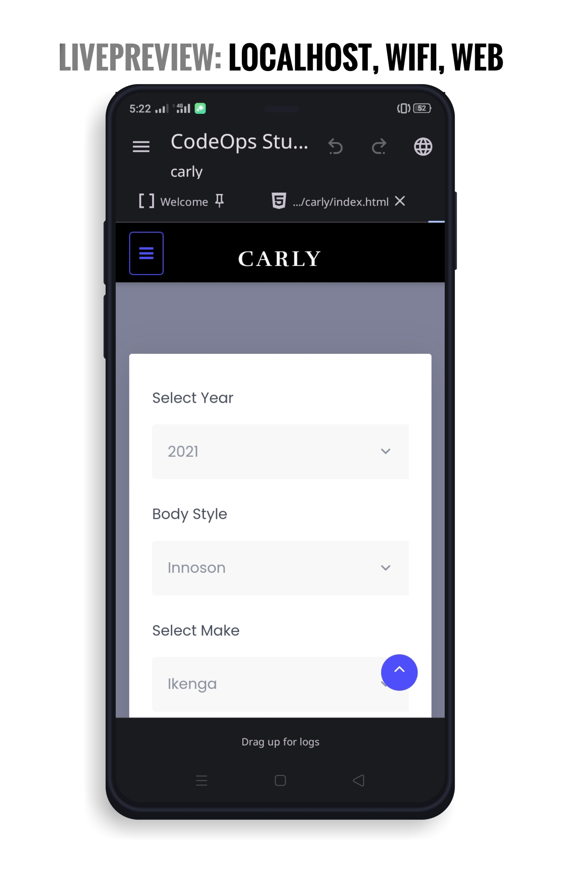

  <h1 style="text-align: center;">
<b>CodeOps Studio</b>
</h1>
  
A FOSS code editor &amp; evolving IDE optimized for Android devices.

  
<small> Code anywhere, anytime. </small>

  
  
  
  
 

> [!NOTE]
> - **Development is temporarily** constrained due to limited hardware resources.
> - Temporarily closed for contributions in Kotlin, Python, C, and C++, until further notice.
> - Pull requests should target: `dev` branch
> - Designed exclusively for: Android 8+ (API 26+)
> - Tablet support (600+ dp) is experimental

## Features

**Implemented**

- [x] File System Explorer
- [x] Advanced Code Editor
- [x] Multi-Pane Tab Interface
- [x] Breadcrumb Navigation
- [x] Web Development Tools
- [x] Multi-Language Syntax Highlighting
- [x] Cross-Storage Volume Access
- [x] Local Server Testing (localhost/WiFi hotspot)

**In Progress**

- [ ] Git Integration (partial)
- [ ] Auto-Completion (partial)

**Roadmap**

- Full Git Integration
- Intelligent Code Completion
- Debugging Tools
- Plugin Ecosystem
- Terminal Integration
- AI Assistant Integration

## Preview

Check out screenshots of CodeOps Studio's interface before installing

  
  
  
  
  
  

## Getting Started

**Current version:** `v1.0.4 beta`

> [!IMPORTANT]
> - Before installing, ensure you have enabled **Install from Unknown Sources** in your device
    settings.
> - Please always install CodeOps Studio from trusted sources only.

### Steps to Install

1. Visit the [GitHub Releases](https://github.com/euptron/CodeOps-Studio/releases) page or
   the [GitHub Actions](https://github.com/euptron/CodeOps-Studio/actions) page.
2. Download the latest CodeOps Studio APK.
3. Install the APK on your device.
4. Start coding anywhere anytime.

## Community

All community links are available [here](./docs/COMMUNITY_LINKS.md).

The major ones include:

- [CodeOps Studio Blog](https://codeopsstudio.blogspot.com)
- [CodeOps Studio X/Twitter](https://x.com/codeopsstudio)
- [CodeOps Studio Telegram Channel](https://t.me/codeopsstudio)

<!--
## Sponsorship

Support CodeOps Studio's growth by becoming a sponsor! Your contributions help us:  
- Improve hardware resources for faster development  
- Expand features and support more languages  
- Maintain and grow the community  

  

-->

## Contribution Guidelines

See the [Contribution Guidelines](./CONTRIBUTING.md) for detailed instructions on how to contribute.

## Code of Conduct

Please note that this project adheres to a [Code of Conduct](./CODE_OF_CONDUCT.md). By
participating, you are expected to uphold this code. For any questions or clarifications, feel free
to open an issue or contact the maintainers.

## License

Copyright (c) Etido Peter. All rights reserved.

Licensed under [GNU GPLv3](./LICENSE).

## Appreciation

A huge thanks to all contributors, testers, and the open-source community for making CodeOps Studio
possible. 
